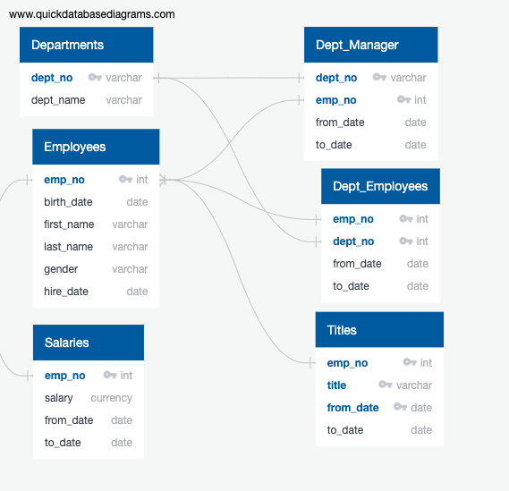

# Retirement Analysis of Pewlett Hackard


## Overview

In this analysis we made a series of queries to our database to obtain key information about the employees that are soon to retire from Pewlett Hackard.

Our database contains a few tables with many relations to the employee id.




## Results

1.  All current employees that are nearing retirement, which means all those who were born between 1962 and 1965 and are currently employeed in the company.
2.  We filtered the previous result to make sure that we only get the latest title of each employee that is nearing retirement, that means that it is their current title.
3.  We can then count how many employees per title are retiring.
4.  Finally, we will look for all current employees that can qualify for the mentorship program, which means that is all those born in 1965.

This is a quick example of our results.

```sql
SELECT *
FROM retiring_titles;
```

<table><tr><th>title</th><th>Employee Count</th></tr><tr><td>Senior Engineer</td><td>25916</td></tr><tr><td>Senior Staff</td><td>24926</td></tr><tr><td>Engineer</td><td>9285</td></tr><tr><td>Staff</td><td>7636</td></tr><tr><td>Technique Leader</td><td>3603</td></tr><tr><td>Assistant Engineer</td><td>1090</td></tr><tr><td>Manager</td><td>2</td></tr></table>


## Summary

We can count the number of employees that are leaving the company by summing the rows in our `retiring_titles` table.

```sql
SELECT SUM("Employee Count")
FROM retiring_titles;
```

<table><tr><th>sum</th></tr><tr><td>72458</td></tr></table>

That means we will need to fill 72,458 positions in the company once those employees retire.

We want to check if there are enough employees that qualify for the mentorship program. So we can get the sum from our other table.

```sql
SELECT COUNT(emp_no)
FROM mentorship_eligibilty;
```

<table><tr><th>count</th></tr><tr><td>1549</td></tr></table>

There are only 1,549 employees in the mentorship program.


## Closing Thoughts
